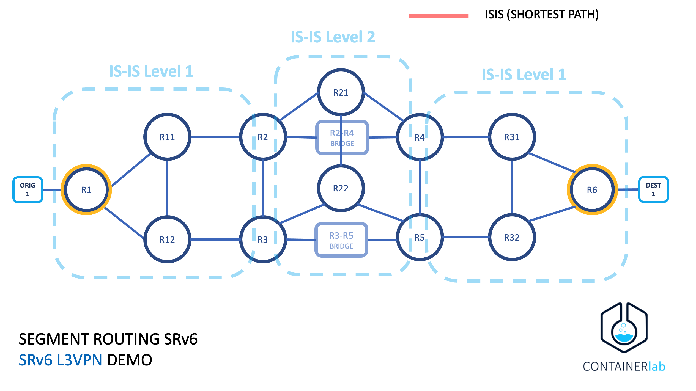
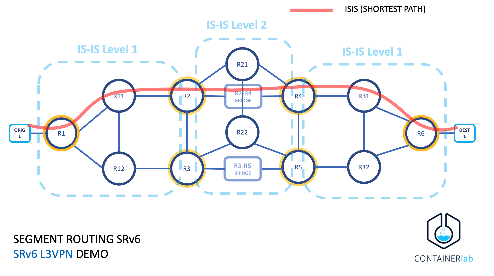

# Segment Routing Lab: SRv6 L3VPN Demo

This lab is showing a simple configuration and verification of SRv6 on Nokia routers to signal both IGP’s shortest path and Algorithms. All router network interfaces for transport are <b>using IPv6</b> and we are encpasulating IPV4 traffic.

Objective: Create a traffic-engineered path between R1 and R6 that uses delay as a metric.

Conditions:
* IGP Metrics: All IGP link metrics are 100
* Delay Metrics: All delay metrics are 10msec with the exception of the R3-R5 link, which is 15msec.


## Network Setup

See topology on the next image:



Next image shows the same with one option of the shortest path using ISIS.



## SRv6 with Flexible Algorithm
Segment Routing (SR) is applied to the IPv6 data plane using 128-bit SIDs and the SR routing header (SRH). The 128-bit SRv6 SID consists of a Locator, a Function, and an Argument.
* The Locator is encoded in the most significant bits of the SID. It is typically routable and leads to the node that instantiated the SID.
* The Function identifies a local endpoint behaviour, such as End, End.X, End.DT4 or End.DT2U.
The Locator is advertised into the IGP and is associated with an Algorithm. As a result, support for Flexible-Algorithm is inherited from day one, and a level of traffic engineering is possible without SRH overhead.
* Flex-Algo 128 SRv6 Locators: Alg128: 2001:db8:4502:n::/64 where n is Node-ID, so 1 is R1, 6 is R6.

## Requeriments
Versions used are:
* containerlab 0.25.1
* vr-sros 22.5.R2 (requires license)

SROS image was created using [VR Network Lab](https://github.com/vrnetlab/vrnetlab)
IMPORTANT: vr-sos must be set as an image in docker to be pull directly by containerlab
```
# docker images | grep vr-sros
vr-sros                               22.5.R2                         f33cd7a3732a        3 months ago        965MB
```

## Overview


If you are new with container lab, we recommed to check the post regading [Nokia SROS in the manual](https://containerlab.dev/manual/kinds/vr-sros/)


## Setting the lab

Create Bridges to use for delay testing and trigger Algorithm 128.

```
brctl addbr R2-R4
brctl addbr R3-R5
ip link set R2-R4 up
ip link set R3-R5 up
```

Use containerlab a specified topology
```
clab deploy --topo topo.yml
```
Checking elements in the lab
```
# clab inspect --topo topo.yml
```
Preping origin and destination containers:
```
docker exec -i clab-srv6-demo-destination1 sh -s < destination1_config.sh
docker exec -i clab-srv6-demo-origin1 sh -s < origin1_config.sh
```
Test connectivity (origin is 10.1.4.101 and destination is using 10.6.4.101)
```
# docker exec -ti clab-srv6-demo-origin1 ping 10.6.4.101
PING 10.6.4.101 (10.6.4.101): 56 data bytes
64 bytes from 10.6.4.101: seq=0 ttl=60 time=11.766 ms
64 bytes from 10.6.4.101: seq=1 ttl=60 time=8.953 ms
64 bytes from 10.6.4.101: seq=2 ttl=60 time=8.865 ms
64 bytes from 10.6.4.101: seq=3 ttl=60 time=8.695 ms
```

# Checking Router configurations

All router smust be part of Algo128 to make it work
```
A:admin@R31# admin show configuration /configure router isis flexible-algorithms
    admin-state enable
    flex-algo 128 {
        participate true
        loopfree-alternate { }
        micro-loop-avoidance { }
    }

[/]
```

Check ISIS database for validation:
```
A:admin@R31# show router isis database R31.00-00 level 1 detail | match "Router Cap" post-lines 10
  Router Cap : 192.0.2.31, D:0, S:0
    TE Node Cap : B E M  P
    SR Cap: IPv4 MPLS-IPv6
       SRGB Base:12000, Range:8000
    <span style="color: red;">SR Alg: metric based SPF, 128</span>
    Node MSD Cap: BMI : 12 ERLD : 15 SRH-MAX-SL : 10 SRH-MAX-END-POP : 9 SRH-MAX-H-ENCAPS : 1 SRH-MAX-END-D : 9
    SRv6 Cap: 0x0000
  I/F Addresses :
    I/F Address   : 192.0.2.31
    I/F Address   : 192.168.0.66
    I/F Address   : 192.168.0.73

[/]
```

